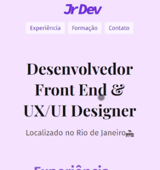

  <a href="#%EF%B8%8F-preview">Preview</a>&nbsp;&nbsp;&nbsp;|&nbsp;&nbsp;&nbsp;
  <a href="#-stacks-utilizadas">Stacks</a>

# Landing page portfólio fictício
Um portfólio fictício de um desenvolvedor front-end / web design, exercício prático do curso da origamid.

## 📝 Aprendizados
Nesse projeto aprendi sobre pseudo-elementos _**before**_ e _**after**_, _**unidades relativas**_, _**responsividade**_, **folhas de estilo em módulos** para que fique mais organizado e _**facilite na manutenção caso precise refatorar algo**_, primeiro projeto que implementei arquitetura _**BEM**_ e tentei colocar todas as _**classes em inglês**_, utilização do pacote cleancss-cli, pacote do _**npm**_ para minificar os arquivos CSS.

## 🖥️📱 Preview
### Link do projeto: <https://juniorcostadev.github.io/portifolioJrDev/>

## 👨‍💻 Stacks utilizadas
  ### Front-end:
  #### HTML:
  * HTML semântico
  * SEO
  
  
  #### CSS3:
  * Grid
  * Flexbox
  * Positions
  * Media Queries

## 🎨 Inspiração:
Figma: <https://www.figma.com/file/HqCW8jiJL8gEcn52qWZBUh/Projeto-portif%C3%B3lio-origamid>

